# 💻 Configuration files for Arch Linux and software

---

<details open>
<summary>EN</summary>

## Key features

- Minimalist, lightweight software following the Unix philosophy — doing one thing well.
- Only official Arch packages for stability and security.
- Simple, transparent config, no unnecessary automation or GUIs, follows KISS.
- Full user control — manual selection and setup.
- Focus on terminal/text tools (bspwm, nvim, tmux, zsh) for efficiency.
- Supports Xorg and Wayland (Hyprland) for a flexible GUI.
- Customizable appearance (polybar, rofi, picom, themes, icons).
- Prioritizes lightness, resource efficiency, and performance.

## 🐧 Arch Linux

<div style="text-align: center;">

  <figure style="display: inline-block; text-align: center; margin: 1em;">
    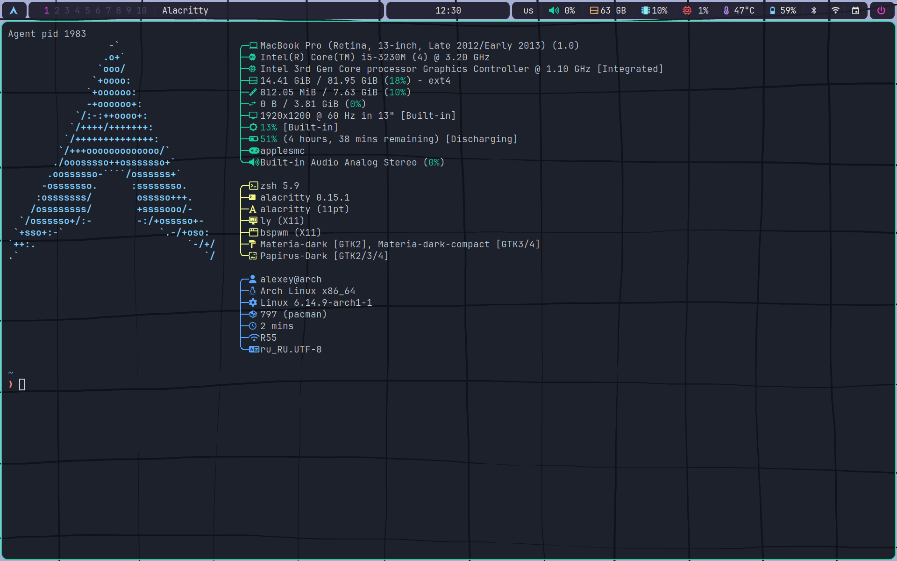
  </figure>
  <p align="center"><strong>Desktop</strong></p>

  <figure style="display: inline-block; text-align: center; margin: 1em;">
    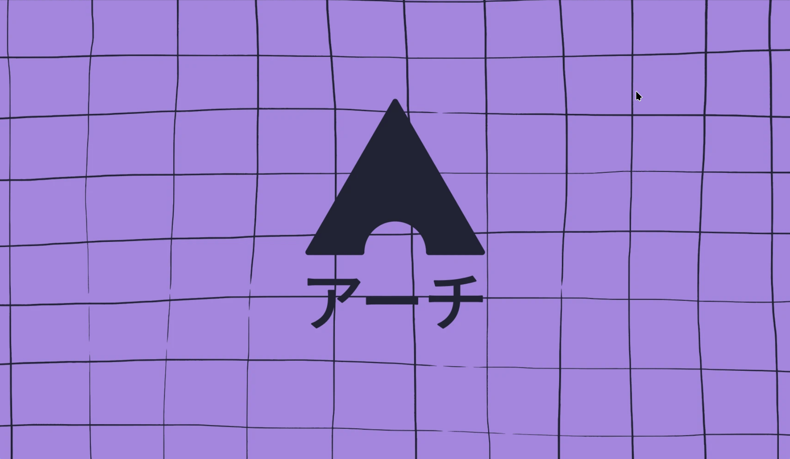
  </figure>
  <p align="center"><strong>Rofi</strong></p>

  <figure style="display: inline-block; text-align: center; margin: 1em;">
    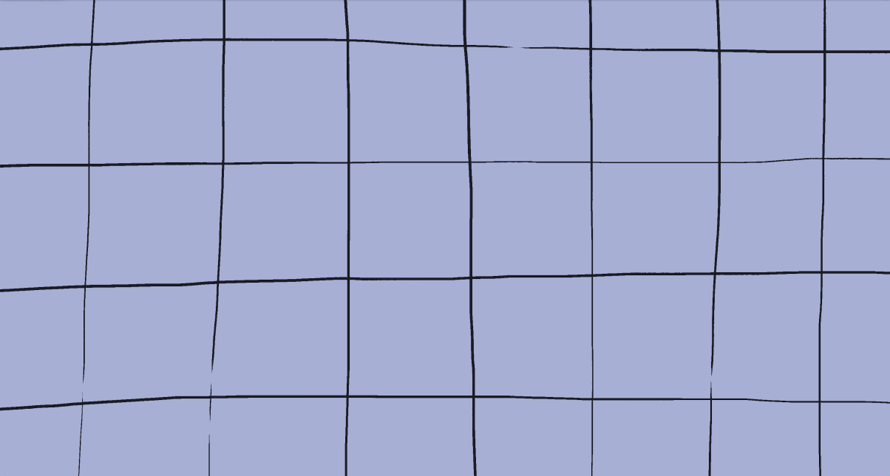
  </figure>
  <p align="center"><strong>Custom powermenu</strong></p>

</div>

### Display servers:

_Supports Xorg or Wayland, by choice_

#### Xorg components:
- [bspwm](https://github.com/baskerville/bspwm) - tiling
- [sxhkd](https://github.com/baskerville/sxhkd) - hotkey daemon
- [picom](https://github.com/yshui/picom) - compositor
- [polybar](https://github.com/polybar/polybar) - status bar
- [rofi](https://github.com/davatorium/rofi) - menu
- [i3lock](https://archlinux.org/packages/extra/x86_64/i3lock/) - screen locker for X

#### Wayland components:
- [hyprland](https://github.com/hyprwm/Hyprland) - tiling / compositor
- [waybar](https://github.com/Alexays/Waybar) - status bar
- [wofi](https://man.archlinux.org/man/wofi.1.en) - menu
- [swaylock](https://github.com/swaywm/swaylock) - screen locker for Wayland

#### Appearance:
- [breeze](https://archlinux.org/packages/extra/x86_64/breeze/) - cursor theme
- [materia-gtk-theme](https://archlinux.org/packages/extra/any/materia-gtk-theme/) - theme
- [papirus-icon-theme](https://github.com/PapirusDevelopmentTeam/papirus-icon-theme) - icons
- [ttf-jetbrains-mono-nerd](https://archlinux.org/packages/extra/any/ttf-jetbrains-mono-nerd/) - font

### Software
- [alacritty](https://github.com/alacritty/alacritty) - terminal emulator
- [tmux](https://github.com/tmux/tmux) - terminal multiplexer
- [neovim](https://github.com/neovim/neovim) - for all things
- [nvchad](https://github.com/NvChad/NvChad) - neovim framework
- [thunar](https://gitlab.xfce.org/xfce/thunar) - file manager GUI
- [ranger](https://github.com/ranger/ranger) - file manager TUI
- [firefox](https://www.mozilla.org/ru/firefox/new/) - main web browser
- [flameshot](https://github.com/flameshot-org/flameshot) - screenshot software
- [cmatrix](https://github.com/abishekvashok/cmatrix) - matrix screensaver
- [htop](https://github.com/htop-dev/htop) - process viewer
- [fastfetch](https://github.com/fastfetch-cli/fastfetch) - system information tool
- [calcurse](https://github.com/lfos/calcurse) - text-based calendar
- [blueman-manager](https://github.com/blueman-project/blueman) - bluetooth manager GUI
- [NetworkManager](https://networkmanager.dev/) - network manager

## 🖍️ Themes

*supports consistent bspwm / polybar / rofi / dunst appearance*

- To switch the color scheme, use Super + Alt + T
- Colors for tmux are set separately in the .tmux.conf file
- Colors for Alacritty and NvChad are configured separately in their respective config files and switched using Leader + T + H respectively

<table>
  <tr>
    <td align="center">
      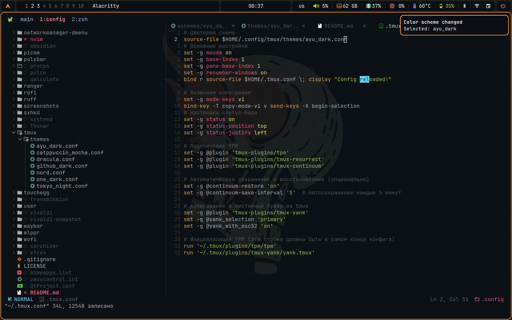<br/>
      <sub>Ayu Dark</sub>
    </td>
    <td align="center">
      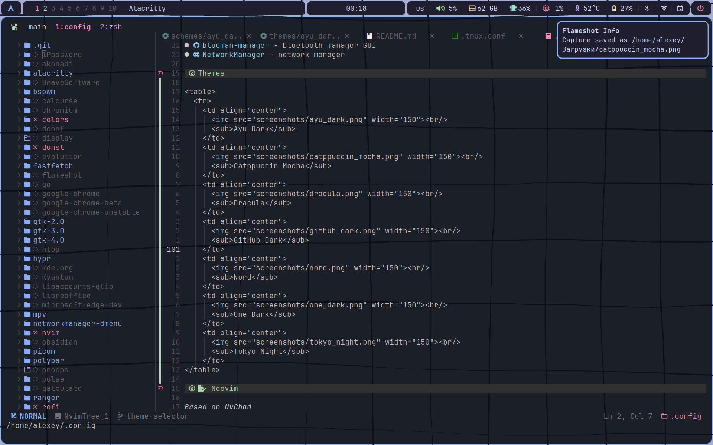<br/>
      <sub>Catppuccin Mocha</sub>
    </td>
    <td align="center">
      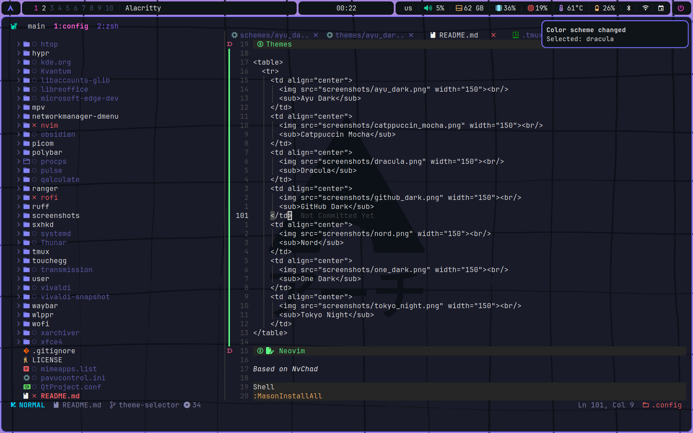<br/>
      <sub>Dracula</sub>
    </td>
    <td align="center">
      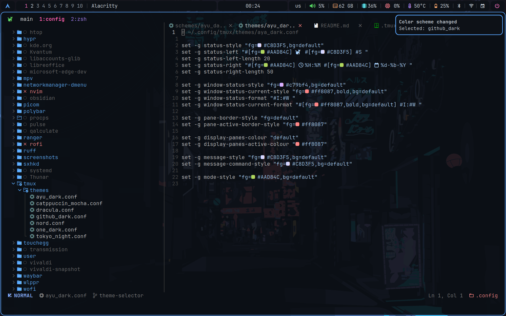<br/>
      <sub>GitHub Dark</sub>
    </td>
    <td align="center">
      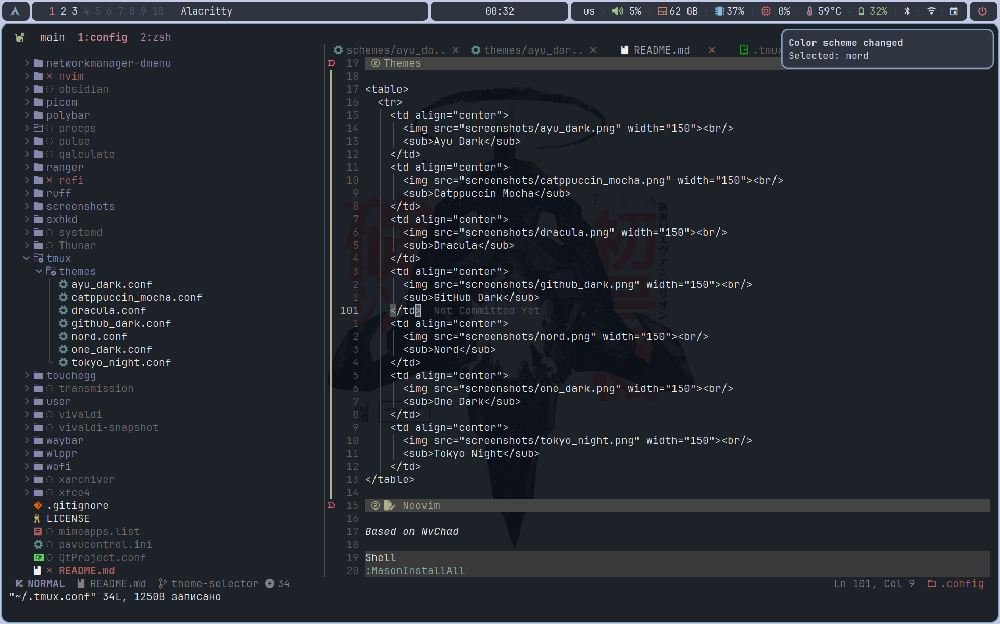<br/>
      <sub>Nord</sub>
    </td>
    <td align="center">
      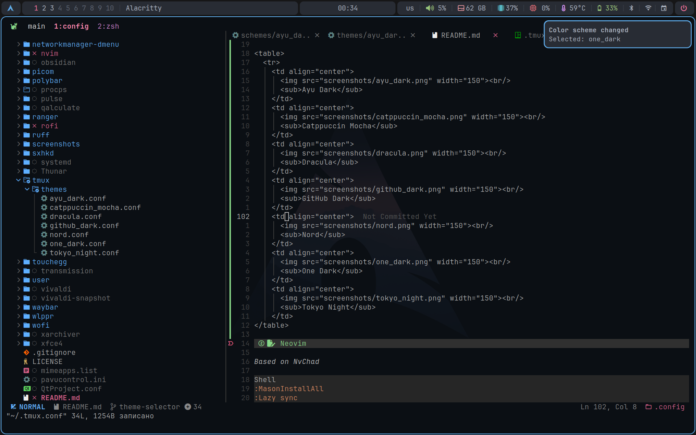<br/>
      <sub>One Dark</sub>
    </td>
    <td align="center">
      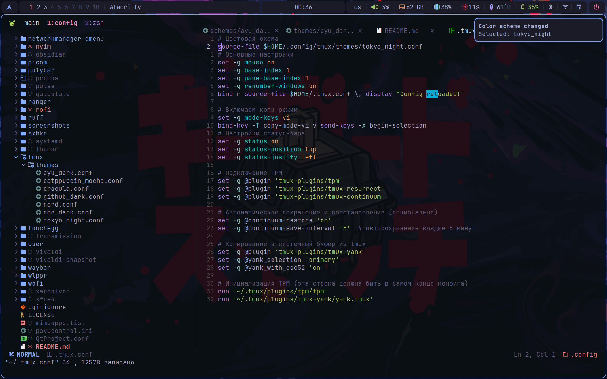<br/>
      <sub>Tokyo Night</sub>
    </td>
</table>

## 📝 Neovim

_Based on NvChad_

```Shell
:MasonInstallAll
:Lazy sync
```

<p align="center">
    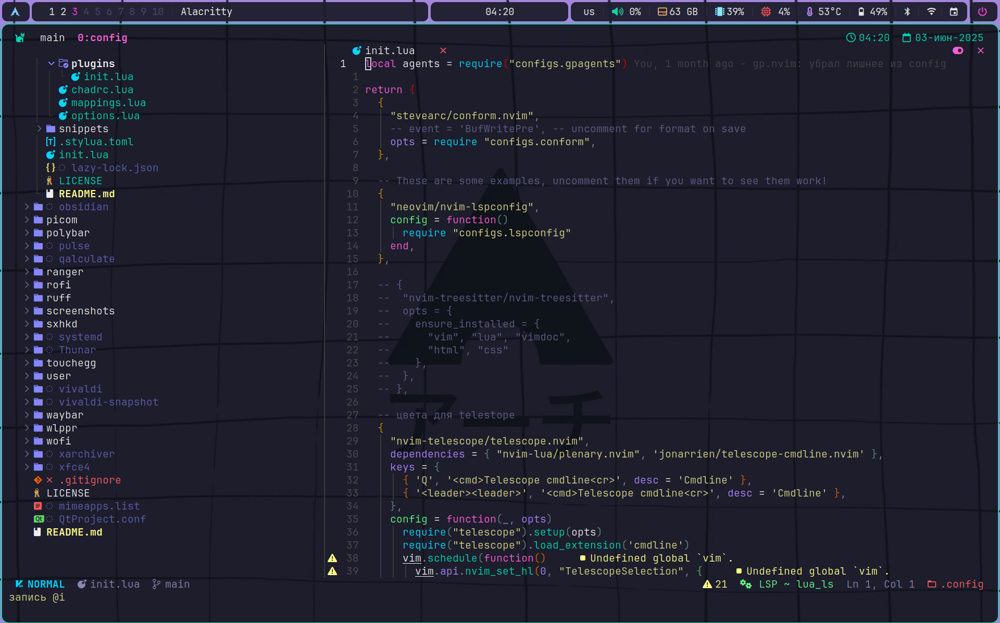
</p>

### Files:
- alacritty/alacritty.toml: config for Alacritty terminal emulator
- nvim: lua config files for neovim
- ruff/pyproject.toml: ruff config
- user: config files for user dir (tmux, zsh, .X*, drivers configuration)

### Requirements:
- npm / fnm pyright
    * npm install -g pyright
- lua
- unzip

## 💡 Inspired by:

- [1](https://github.com/gh0stzk/dotfiles)
- [2](https://github.com/Zproger/bspwm-dotfiles)
- [3](https://github.com/raexera/tokyo)

## 🖼 Wallpapers by:

- [1](https://github.com/gh0stzk/dotfiles)
- [2](https://github.com/connorslade/ArchPapers)
- [3](https://github.com/LagrangianLad/arch-minimal-wallpapers)
- [4](https://github.com/archcraft-os/archcraft-wallpapers)
- [5](https://github.com/raexera/tokyo)

## F.A.Q

<details>
<summary>Appearance</summary>

1. How to set up the wallpaper?
Answer:
In **~/.xprofile** add the line:

```Shell
export LOCKSCREEN_IMAGE="$HOME/.config/wlppr/skull.png"

```

2. How to set up bspwm / rofi / polybar / dunst consistent theme?
Answer:

```Shell
SUPER + ALT + T

```

3. How to set up NvChad theme?
Answer:

```Shell
Leader + T + H

```

4. How to set up Alacritty theme?
Answer:
In **~/.config/alacritty/alacritty.toml** change:

```Shell
import = [
  "~/.config/alacritty/alacritty-theme/themes/ayu_dark.toml"
]

```

5. How to set tmux theme?
Answer:
In **~/.tmux.conf** change:

```Shell
source-file $HOME/.config/tmux/themes/ayu_dark.conf

```

</details>

</details>

---

<details>
<summary>RU</summary>

## Ключевые особенности

- Минималистичный, лёгкий софт, следующий философии Unix — программы, которые делают одну вещь хорошо.
- Используются только официальные пакеты Arch для стабильности и безопасности.
- Простая, прозрачная конфигурация, без лишней автоматизации и графических оболочек, соблюдающая принцип KISS.
- Пользователь сам контролирует настройки своей системы через конфигурационные файлы.
- Акцент на терминальные и текстовые инструменты (bspwm, nvim, tmux, zsh).
- Поддержка графической среды Xorg либо Wayland (Hyprland).
- Настраиваемый внешний вид (polybar, rofi, picom, темы, иконки).
- В приоритете лёгкость, экономия ресурсов и производительность.

## 🐧 Arch Linux

<div style="text-align: center;">

  <figure style="display: inline-block; text-align: center; margin: 1em;">
    
  </figure>
  <p align="center"><strong>Рабочий стол</strong></p>

  <figure style="display: inline-block; text-align: center; margin: 1em;">
    
  </figure>
  <p align="center"><strong>Список приложений</strong></p>

  <figure style="display: inline-block; text-align: center; margin: 1em;">
    
  </figure>
  <p align="center"><strong>Меню выключения / перезагрузки / сна и т.д.</strong></p>

</div>

### Серверы отображения:

_Поддержка Xorg или Wayland, по выбору_

#### Компоненты Xorg:
- [bspwm](https://github.com/baskerville/bspwm) — тайлинговый оконный менеджер
- [sxhkd](https://github.com/baskerville/sxhkd) — демон горячих клавиш
- [picom](https://github.com/yshui/picom) — композитор
- [polybar](https://github.com/polybar/polybar) — статус-бар
- [rofi](https://github.com/davatorium/rofi) — меню
- [i3lock](https://archlinux.org/packages/extra/x86_64/i3lock/) - блокировщик экрана для X

#### Компоненты Wayland:
- [hyprland](https://github.com/hyprwm/Hyprland) — тайлинг / композитор
- [waybar](https://github.com/Alexays/Waybar) — статус-бар
- [wofi](https://man.archlinux.org/man/wofi.1.en) — меню
- [swaylock](https://github.com/swaywm/swaylock) - блокировщик экрана для Wayland

#### Оформление:
- [breeze](https://archlinux.org/packages/extra/x86_64/breeze/) — тема курсора
- [materia-gtk-theme](https://archlinux.org/packages/extra/any/materia-gtk-theme/) — тема оформления
- [papirus-icon-theme](https://github.com/PapirusDevelopmentTeam/papirus-icon-theme) — иконки
- [ttf-jetbrains-mono-nerd](https://archlinux.org/packages/extra/any/ttf-jetbrains-mono-nerd/) — шрифт

### Программное обеспечение
- [alacritty](https://github.com/alacritty/alacritty) — эмулятор терминала
- [tmux](https://github.com/tmux/tmux) — мультиплексор терминала
- [neovim](https://github.com/neovim/neovim) — для всего
- [nvchad](https://github.com/NvChad/NvChad) — фреймворк для neovim
- [thunar](https://gitlab.xfce.org/xfce/thunar) — файловый менеджер GUI
- [ranger](https://github.com/ranger/ranger) — файловый менеджер TUI
- [firefox](https://www.mozilla.org/ru/firefox/new/) — основной веб-браузер
- [flameshot](https://github.com/flameshot-org/flameshot) — программа для скриншотов
- [cmatrix](https://github.com/abishekvashok/cmatrix) — скринсейвер
- [htop](https://github.com/htop-dev/htop) — просмотр процессов
- [fastfetch](https://github.com/fastfetch-cli/fastfetch) — инструмент вывода системной информации
- [calcurse](https://github.com/lfos/calcurse) — календарь TUI
- [blueman-manager](https://github.com/blueman-project/blueman) — менеджер Bluetooth GUI
- [NetworkManager](https://networkmanager.dev/) — менеджер сети

## 🖍️ Цветовые схемы

*поддержка консистентного внешнего вида bspwm / polybar / rofi / dunst*

- Для смены цветовой схемы используйте Super + Alt + T
- Цвета для tmux настраиваются отдельно в файле .tmux.conf
- Цвета для Alacritty и NvChad настраиваются отдельно в их конфигурационных файлах и переключаются с помощью сочетания Leader + T + H соответственно

<table>
  <tr>
    <td align="center">
      <br/>
      <sub>Ayu Dark</sub>
    </td>
    <td align="center">
      <br/>
      <sub>Catppuccin Mocha</sub>
    </td>
    <td align="center">
      <br/>
      <sub>Dracula</sub>
    </td>
    <td align="center">
      <br/>
      <sub>GitHub Dark</sub>
    </td>
    <td align="center">
      <br/>
      <sub>Nord</sub>
    </td>
    <td align="center">
      <br/>
      <sub>One Dark</sub>
    </td>
    <td align="center">
      <br/>
      <sub>Tokyo Night</sub>
    </td>
</table>

## 📝 Neovim

_Основан на NvChad_

```Shell
:MasonInstallAll
:Lazy sync
```


<p align="center">
    
</p>

### Файлы:
- alacritty/alacritty.toml: конфигурация для эмулятора терминала Alacritty
- nvim: lua-конфиги для neovim
- ruff/pyproject.toml: конфигурация ruff
- user: конфигурационные файлы для пользовательской директории (tmux, zsh, .X*, настройки драйверов)

### Зависимости:
- npm / fnm / pyright
  * `npm install -g pyright`
- lua
- unzip

## 💡 Вдохновлено:

- [1](https://github.com/gh0stzk/dotfiles)
- [2](https://github.com/Zproger/bspwm-dotfiles)
- [3](https://github.com/raexera/tokyo)

## 🖼 Обои:

- [1](https://github.com/gh0stzk/dotfiles)
- [2](https://github.com/connorslade/ArchPapers)
- [3](https://github.com/LagrangianLad/arch-minimal-wallpapers)
- [4](https://github.com/archcraft-os/archcraft-wallpapers)
- [5](https://github.com/raexera/tokyo)

## F.A.Q

<details>
<summary>Внешний вид</summary>

1. Как установить обои рабочего стола?
Ответ:
В файле **~/.xprofile** добавьте строку:

```Shell
export LOCKSCREEN_IMAGE="$HOME/.config/wlppr/skull.png"

```

2. Как установить bspwm / rofi / polybar / dunst консистентную цветовую схему?
Ответ:

```Shell
SUPER + ALT + T

```

3. Как установить цветовую схему NvChad?
Ответ:

```Shell
Leader + T + H

```

4. Как установить цветовую схему Alacritty?
Ответ:
В файле **~/.config/alacritty/alacritty.toml** измените:

```Shell
import = [
  "~/.config/alacritty/alacritty-theme/themes/ayu_dark.toml"
]

```

5. Как установить цветовую схему tmux?
Ответ:
В файле **~/.tmux.conf** измените:

```Shell
source-file $HOME/.config/tmux/themes/ayu_dark.conf

```

</details>

</details>

---
