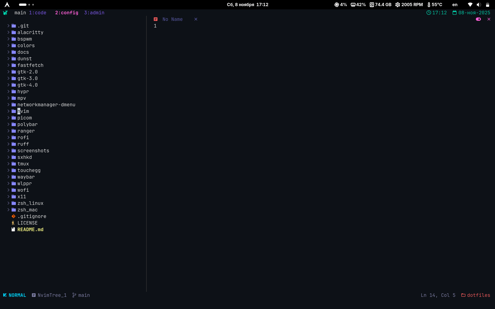
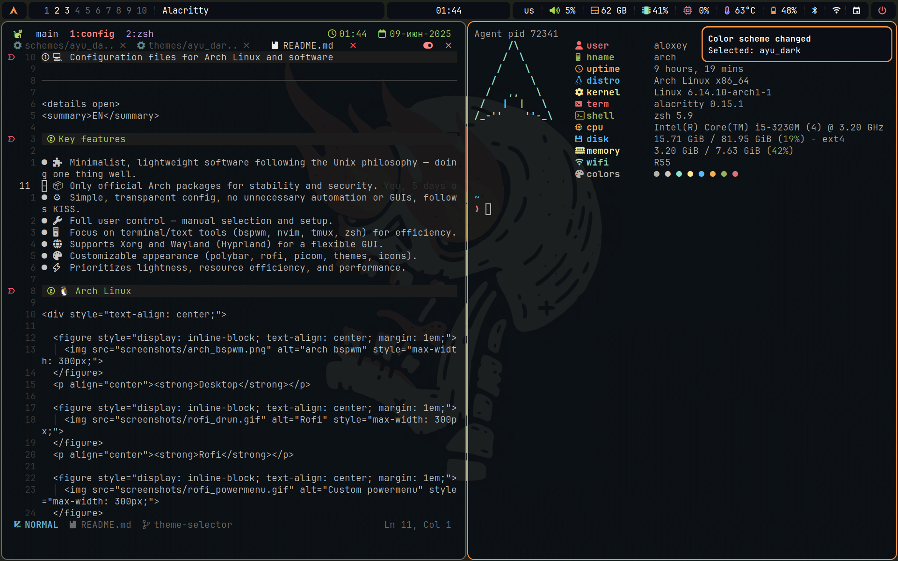
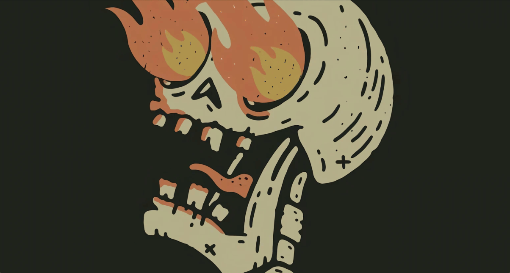

# 💻 Configuration files for Arch Linux and software

---

GNOME

[GNOME configuration](docs/gnome.md).

  <figure style="display: inline-block; text-align: center; margin: 1em;">
    
  </figure>
  
<strong>Desktop</strong>

  <figure style="display: inline-block; text-align: center; margin: 1em;">
    
  </figure>
  
<strong>nvim</strong>

BSPWM

[BSPWM configuration](docs/bspwm.md).

  <figure style="display: inline-block; text-align: center; margin: 1em;">
    
  </figure>
  
<strong>Desktop</strong>

  <figure style="display: inline-block; text-align: center; margin: 1em;">
    
  </figure>
  
<strong>Rofi</strong>

  <figure style="display: inline-block; text-align: center; margin: 1em;">
    
  </figure>
  
<strong>Custom powermenu</strong>

---
