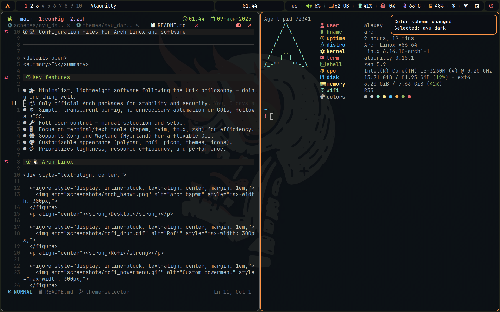
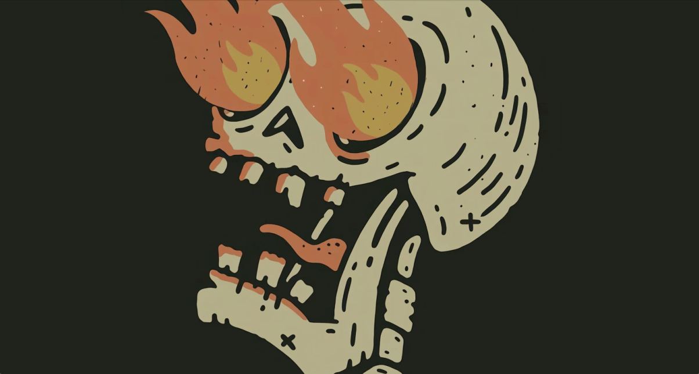
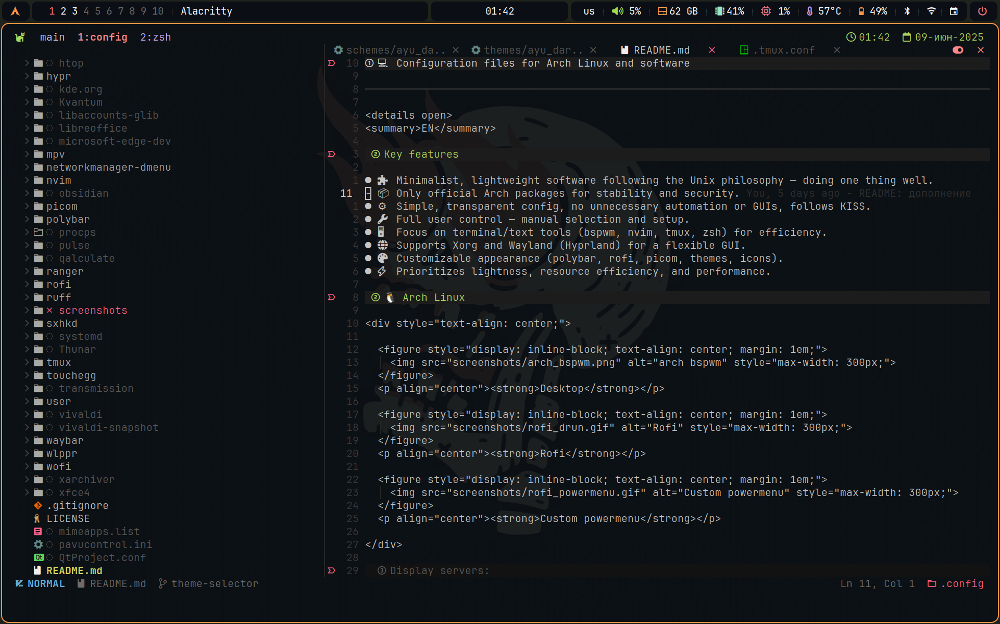
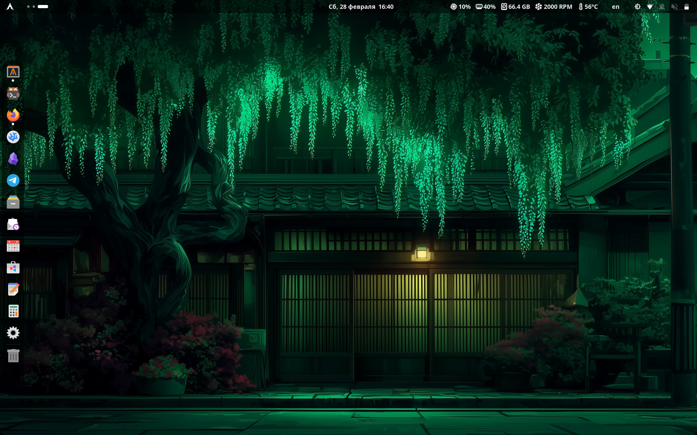
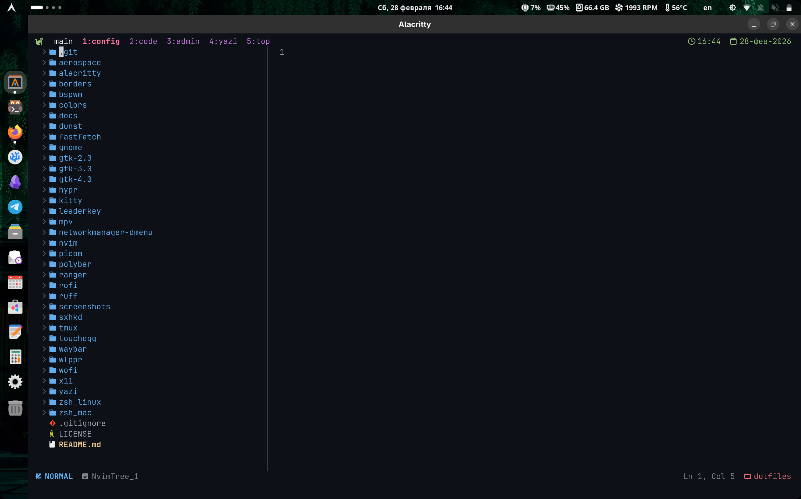

# dotfiles

Конфиги для Arch Linux. Управление через GNU Stow.

[bspwm](#bspwm) · [GNOME](#gnome) · [Hyprland](#hyprland)

---

<details open>
<summary>EN</summary>

## Stack

| Category | Software |
|---|---|
| WM | bspwm + sxhkd |
| Bar | polybar |
| Compositor | picom |
| Launcher | rofi |
| Notifications | dunst |
| Terminal | alacritty |
| Shell | zsh + oh-my-zsh |
| Font | JetBrains Mono Nerd Font |
| Theme | Breeze / Papirus-Dark / Bibata-Modern-Ice |

## Machine-specific config

All machine-specific settings in `~/.config/env/env` (gitignored):

```
HIDPI_FACTOR=175    # 100 = 1080p, 175 = Retina 13"
THEME_MODE=dark     # dark | light
INTERNAL_MONITOR="eDP-1"
EXTERNAL_MONITOR="DP-1"
POLYBAR_BATTERY="BAT0"
```

`HIDPI_FACTOR` scales everything: DPI, cursor, polybar, rofi, dunst, picom corners, bspwm borders. One number, no per-app configs.

`THEME_MODE` toggles dark/light for all GTK apps including Chromium.

## Quick start

```bash
git clone https://github.com/hwpy/dotfiles.git ~/dotfiles
cd ~/dotfiles

stow env
cp ~/.config/env/env.template ~/.config/env/env
# edit: monitors, HIDPI_FACTOR, THEME_MODE

stow bspwm polybar sxhkd picom dunst rofi
stow x11 colors gtk-3.0 gtk-4.0
stow nvim zsh_linux tmux bin
```

[Documentation →](docs/bspwm.md)

## BSPWM





## GNOME




[Extensions and settings →](docs/gnome.md)

## Hyprland

Config: `hypr/`. Wayland session with waybar, wofi, hyprpaper.

</details>

---

<details>
<summary>RU</summary>

## Стек

| Категория | Софт |
|---|---|
| WM | bspwm + sxhkd |
| Бар | polybar |
| Композитор | picom |
| Лаунчер | rofi |
| Уведомления | dunst |
| Терминал | alacritty |
| Оболочка | zsh + oh-my-zsh |
| Шрифт | JetBrains Mono Nerd Font |
| Тема | Breeze / Papirus-Dark / Bibata-Modern-Ice |

## Настройки компьютера

Все настройки конкретного компьютера в `~/.config/env/env` (gitignored):

```
HIDPI_FACTOR=175    # 100 = 1080p, 175 = Retina 13"
THEME_MODE=dark     # dark | light
INTERNAL_MONITOR="eDP-1"
EXTERNAL_MONITOR="DP-1"
POLYBAR_BATTERY="BAT0"
```

`HIDPI_FACTOR` масштабирует всё: DPI, курсор, polybar, rofi, dunst, скругления picom, рамки bspwm. Одно число, без правки конфигов отдельных приложений.

`THEME_MODE` переключает тёмную/светлую тему для всех GTK-приложений, включая Chromium.

## Быстрый старт

```bash
git clone https://github.com/hwpy/dotfiles.git ~/dotfiles
cd ~/dotfiles

stow env
cp ~/.config/env/env.template ~/.config/env/env
# указать: мониторы, HIDPI_FACTOR, THEME_MODE

stow bspwm polybar sxhkd picom dunst rofi
stow x11 colors gtk-3.0 gtk-4.0
stow nvim zsh_linux tmux bin
```

[Документация →](docs/bspwm.md)

## BSPWM


## GNOME


[Расширения и настройки →](docs/gnome.md)

## Hyprland

Конфиг: `hypr/`. Wayland-сессия с waybar, wofi, hyprpaper.

</details>
