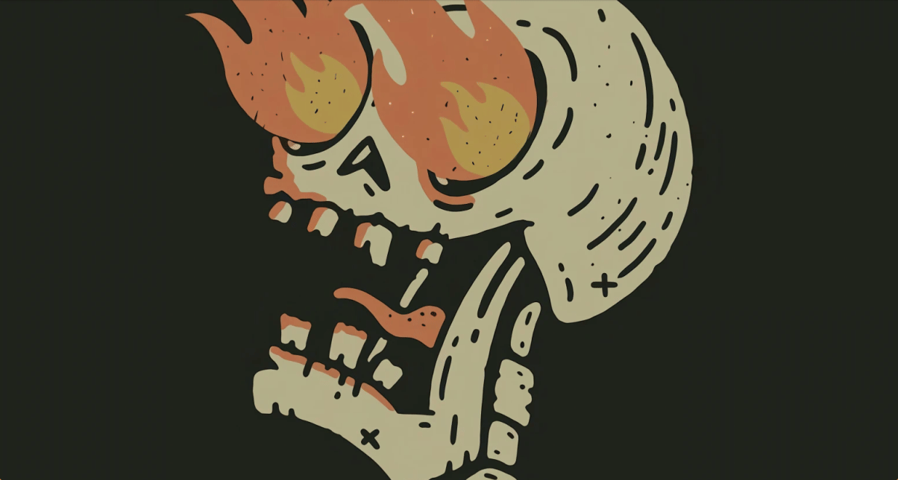
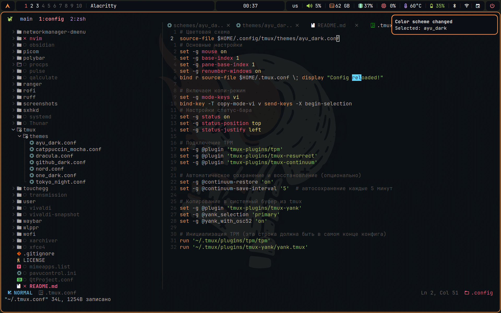
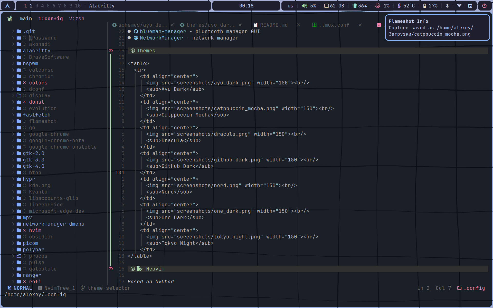
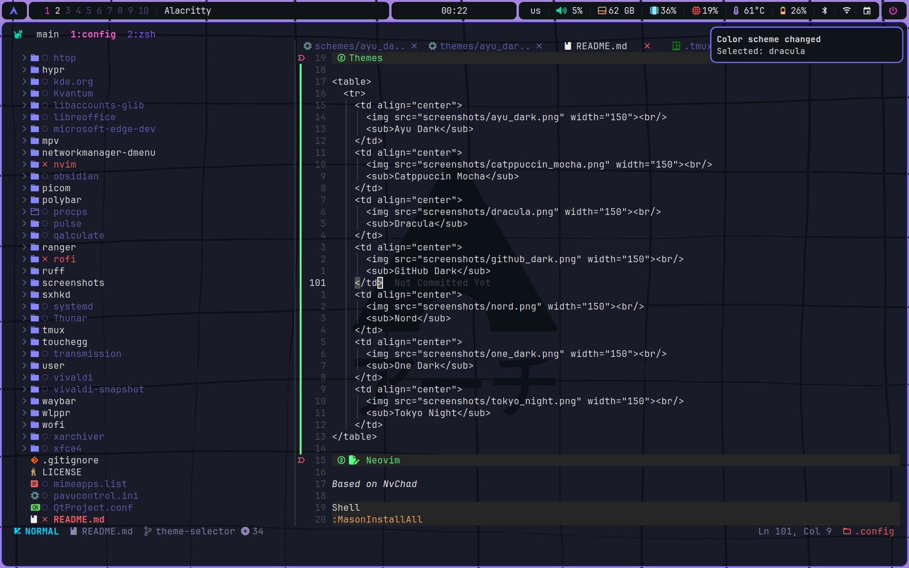
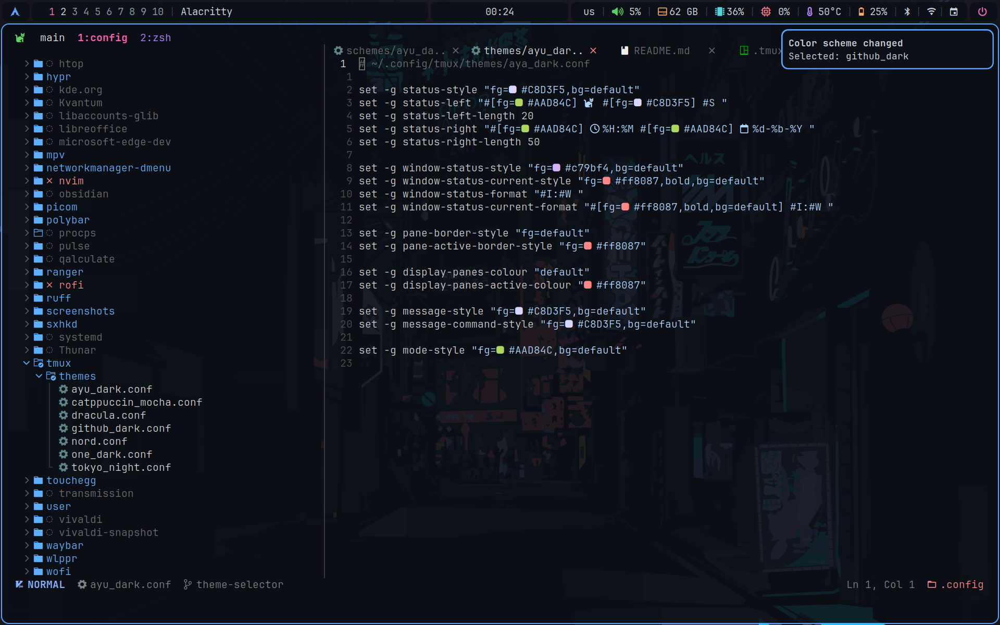
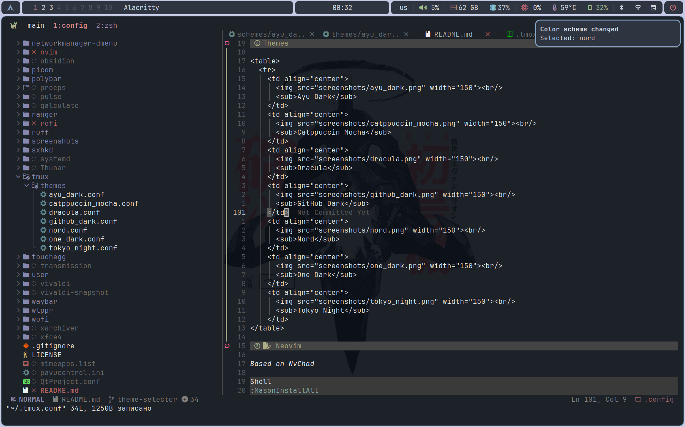
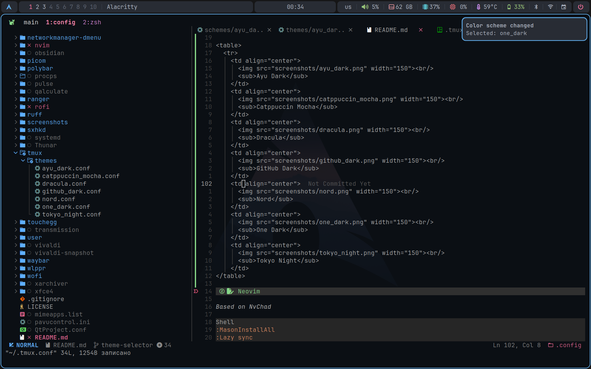
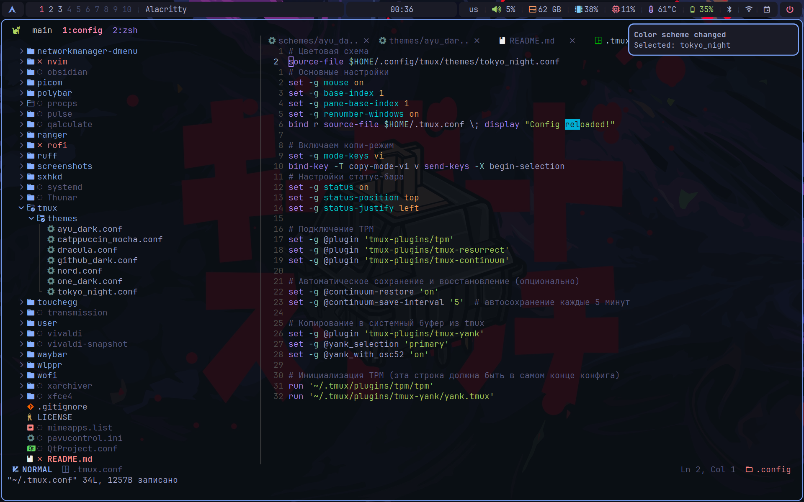

# BSPWM

<details open>
<summary>EN</summary>



## Startup

```
.xprofile → .xinitrc → bspwm → bspwmrc
    │                       │
    ├─ Xft.dpi, cursor      ├─ monitors, polybar, picom, dunst, sxhkd
    ├─ disable DWT           ├─ color scheme
    ├─ XDG_SESSION_TYPE      └─ touchegg
    ├─ QT_QPA_PLATFORM
    └─ apply-gtk-theme
```

## Scaling

One variable — `HIDPI_FACTOR` in env. All sizes are `base × F / 100`.

| Property | Base | F=100 | F=175 |
|---|---|---|---|
| Xft.dpi | 96 | 96 | 168 |
| Xcursor.size | 24 | 24 | 42 |
| Polybar height | 20pt | 20 | 35 |
| Polybar font0 | 10px | 10 | 17 |
| Rofi font | 11px | 11 | 19 |
| Rofi width | 467px | 467 | 817 |
| Dunst font | 10pt | — | — |
| Dunst width | 200px | 200 | 350 |
| Picom corner-radius | 9 | 9 | 15 |
| Bspwm border | 2 | 2 | 3 |
| Resize step | 30 | 30 | 52 |

Dunst font is points — Pango scales it via Xft.dpi automatically.

## Dark/Light

`THEME_MODE=dark` or `light` in env. Toggled by `apply-gtk-theme` (called from `.xprofile` and `switch-theme`):

- Flips `gtk-application-prefer-dark-theme` in `settings.ini` (affects all GTK apps + Chromium)
- Sets `color-scheme` via gsettings (for portal-aware apps)
- Cursor size removed from `settings.ini` — GTK reads Xcursor directly

## Color schemes

| Scheme | Switch |
|---|---|
| Tokyo Night | Super + Alt + T |
| Tokyo Dark | —"— |
| Nord | —"— |
| Catppuccin Mocha | —"— |
| Dracula | —"— |
| Ayu Dark | —"— |
| One Dark | —"— |
| GitHub Dark | —"— |

Syncs: bspwm, polybar, rofi, dunst. Terminals and Neovim have separate theme systems.

<p align="center">
  
  
  
  
  
  
  
</p>

## Session (X11 vs Wayland)

`~/.local/bin/chromium` — wrapper, checks `$DISPLAY` / `$WAYLAND_DISPLAY`, passes correct `--ozone-platform`. `.xprofile` sets `XDG_SESSION_TYPE=x11` and `QT_QPA_PLATFORM=xcb` for X11. Hyprland handles Wayland via its own env.

## Keys

| Key | Action |
|---|---|
| Super + Enter | Terminal |
| Super + D | Apps (rofi drun) |
| Alt + D | Windows (rofi window) |
| Super + Q | Close |
| Super + Shift + Q | Kill |
| Super + H/J/K/L | Focus |
| Super + Shift + H/J/K/L | Move |
| Super + 1-6 | Desktop |
| Super + S | Float |
| Super + M | Monocle / tiled |
| Super + F | Fullscreen |
| Super + Alt + T | Switch color scheme |
| Super + Alt + R | Restart bspwm |
| Super + Alt + Q | Quit |

## Touchpad (touchegg)

| Gesture | Action |
|---|---|
| 3 ↑ | Float / tile |
| 3 ↓ | Monocle / tile |
| 3 ←→ | Prev / next desktop |
| 4 ↑↓ | Change desktop |
| 4 pinch out | Show desktop |

Touchpad not locked while typing (`libinput Disable While Typing Enabled = 0`).

## Packages

| Package | Target |
|---|---|
| `bspwm` | `~/.config/bspwm/` |
| `sxhkd` | `~/.config/sxhkd/` |
| `polybar` | `~/.config/polybar/` |
| `picom` | `~/.config/picom/` |
| `rofi` | `~/.config/rofi/` |
| `dunst` | `~/.config/dunst/` |
| `x11` | `~/.xprofile`, `~/.xinitrc`, `~/.Xresources` |
| `colors` | `~/.config/colors/` |
| `gtk-3.0` | `settings.ini` |
| `gtk-4.0` | `settings.ini` |
| `env` | `env.template` |
| `bin` | `~/.local/bin/chromium` |
| `touchegg` | `~/.config/touchegg/` |

[Initial setup →](en/bspwm/initial_setup.md)
[Deploy →](en/bspwm/dotfiles_setup.md)

</details>

---

<details>
<summary>RU</summary>


## Запуск

```
.xprofile → .xinitrc → bspwm → bspwmrc
    │                       │
    ├─ Xft.dpi, курсор      ├─ мониторы, polybar, picom, dunst, sxhkd
    ├─ откл. DWT            ├─ цветовая схема
    ├─ XDG_SESSION_TYPE      └─ touchegg
    ├─ QT_QPA_PLATFORM
    └─ apply-gtk-theme
```

## Масштабирование

Одна переменная — `HIDPI_FACTOR` в env. Все размеры: `база × F / 100`.

| Свойство | База | F=100 | F=175 |
|---|---|---|---|
| Xft.dpi | 96 | 96 | 168 |
| Xcursor.size | 24 | 24 | 42 |
| Polybar высота | 20pt | 20 | 35 |
| Polybar шрифт0 | 10px | 10 | 17 |
| Rofi шрифт | 11px | 11 | 19 |
| Rofi ширина | 467px | 467 | 817 |
| Dunst шрифт | 10pt | — | — |
| Dunst ширина | 200px | 200 | 350 |
| Picom скругления | 9 | 9 | 15 |
| Bspwm рамки | 2 | 2 | 3 |
| Шаг ресайза | 30 | 30 | 52 |

Шрифт Dunst в пунктах — Pango сам масштабирует через Xft.dpi.

## Тёмная/светлая тема

`THEME_MODE=dark` или `light` в env. Переключается `apply-gtk-theme` (вызывается из `.xprofile` и `switch-theme`):

- Меняет `gtk-application-prefer-dark-theme` в `settings.ini` (все GTK-приложения + Chromium)
- Выставляет `color-scheme` через gsettings (для приложений через портал)
- Размер курсора убран из `settings.ini` — GTK читает Xcursor напрямую

## Цветовые схемы

| Схема | Переключение |
|---|---|
| Tokyo Night | Super + Alt + T |
| Tokyo Dark | —"— |
| Nord | —"— |
| Catppuccin Mocha | —"— |
| Dracula | —"— |
| Ayu Dark | —"— |
| One Dark | —"— |
| GitHub Dark | —"— |

Синхронизирует: bspwm, polybar, rofi, dunst. Терминалы и Neovim — отдельные системы тем.

<p align="center">
  
  
  
  
  
  
  
</p>

## Сессия (X11 vs Wayland)

`~/.local/bin/chromium` — враппер, проверяет `$DISPLAY` / `$WAYLAND_DISPLAY`, передаёт нужный `--ozone-platform`. `.xprofile` выставляет `XDG_SESSION_TYPE=x11` и `QT_QPA_PLATFORM=xcb` для X11. Hyprland работает с Wayland через свой env.

## Клавиши

| Клавиша | Действие |
|---|---|
| Super + Enter | Терминал |
| Super + D | Приложения (rofi drun) |
| Alt + D | Окна (rofi window) |
| Super + Q | Закрыть |
| Super + Shift + Q | Убить |
| Super + H/J/K/L | Фокус |
| Super + Shift + H/J/K/L | Переместить |
| Super + 1-6 | Рабочий стол |
| Super + S | Float |
| Super + M | Monocle / tiled |
| Super + F | Fullscreen |
| Super + Alt + T | Смена схемы |
| Super + Alt + R | Перезапуск bspwm |
| Super + Alt + Q | Выход |

## Тачпад (touchegg)

| Жест | Действие |
|---|---|
| 3 ↑ | Float / tile |
| 3 ↓ | Monocle / tile |
| 3 ←→ | Предыдущий / следующий стол |
| 4 ↑↓ | Смена стола |
| 4 pinch out | Показать стол |

Тачпад не блокируется при печати (`libinput Disable While Typing Enabled = 0`).

## Пакеты

| Пакет | Куда |
|---|---|
| `bspwm` | `~/.config/bspwm/` |
| `sxhkd` | `~/.config/sxhkd/` |
| `polybar` | `~/.config/polybar/` |
| `picom` | `~/.config/picom/` |
| `rofi` | `~/.config/rofi/` |
| `dunst` | `~/.config/dunst/` |
| `x11` | `~/.xprofile`, `~/.xinitrc`, `~/.Xresources` |
| `colors` | `~/.config/colors/` |
| `gtk-3.0` | `settings.ini` |
| `gtk-4.0` | `settings.ini` |
| `env` | `env.template` |
| `bin` | `~/.local/bin/chromium` |
| `touchegg` | `~/.config/touchegg/` |

[Первоначальная настройка →](ru/bspwm/initial_setup.md)
[Развёртывание →](ru/bspwm/dotfiles_setup.md)

</details>
